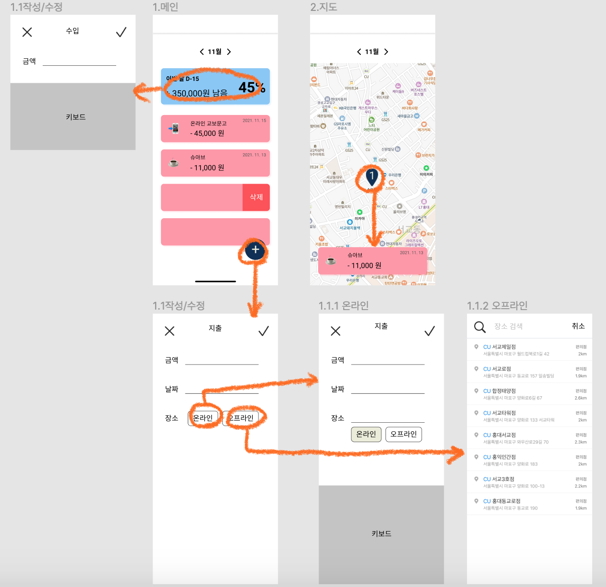
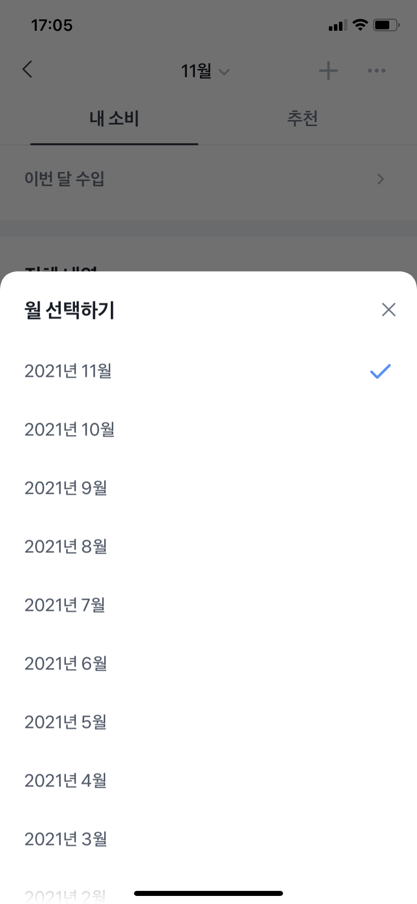
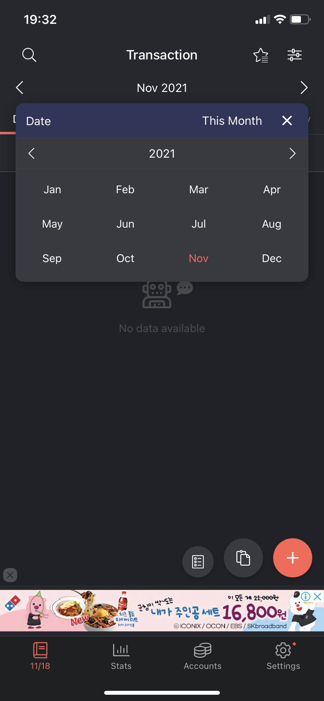
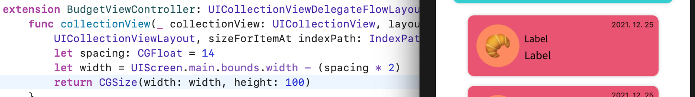
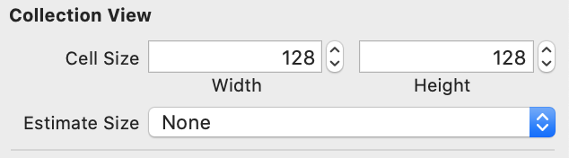

# DAILY LOG

🟡 [Day1 - 211115](#day1---211115)

🟡 [Day2 - 211116](#day2---211116)

🟡 [Day3 - 211117](#day3---211117)

🟡 [Day4 - 211118](#day4---211118)

🟡 [Day5 - 211119](#day5---211119)

🟡 [Day7 - 211121](#day7---211121)

🟡 [Day8 - 211122](#day8---211122)

🟡 [Day9 - 211123](#day9---211123)

<br>

<hr>

## Day1 - 211115

* ### 와이어프레임



> [색조합](https://colorhunt.co/palette/118df00e2f56ff304fececda)

<br>

* ### 기획

  * 사용자 위치
  * API: 카카오, 네이버지도
  * Realm

| 화면                   | 상세                                                         |
| ---------------------- | ------------------------------------------------------------ |
| **메인**               | - 달별로 확인 가능<br>- 수입 클릭 시 아래 숫자 키보드로 간단하게 입력<br>- *아래 지출 부분만 tableView(collectionView)<br>- selectRowAt: 수정<br>- 삭제<br>- 플로팅버튼 선택 시 입력창 modal fullscreen<br>- *아래 버튼 클릭시 지도뷰(레퍼런스: 현대카드 웨더) or 11월 아래부분 옆으로 스와이프시 |
| **작성/수정**          | - 플로팅 버튼: 입력, cell: 수정<br>- 금액부분에 커서, 키보드 숫자로 바로 띄워주기<br>- 금액 , 처리<br>- 날짜 datePicker (month) |
| **작성/수정-온라인**   | - 온라인 버튼 클릭시, textfield 생기고 키보드 올리기         |
| **작성/수정-오프라인** | - 오프라인 버튼 클릭시, searchController<br>- `카카오API` 키워드로 장소검색하기<br>- 현재위치 기준으로 반경 3키로 내 |
| **지도**               | - 오프라인 결제한곳 띄워주기<br>- `네이버지도API` <br>- custom marker(안되면 그냥 찍기)<br>- 전체보여주기<br>- 현재위치 버튼 좌측 하단 |
| **지도선택**           | - *마커 클릭시, 아래 tableView or collectionView 가로 <br>- 수정, 삭제 가능 |

<br>

<br>

## Day2 - 211116

* [기획서](./projectplan.md) 

<br>

### ⚡️TEAM BUILDING

* 팀원들과 기획을 간단히 공유했다
* 성용님이 뷰가 적다는 피드백을 해주셔서 좀 더 늘려보려고 한다

<br>

<br>

## Day3 - 211117

* [발표자료](./presentation.md) 

* 폰트, 에셋, 컬러 Extension 설정: figma에서 제플린으로 export해왔다. 제플린 쓰니까 엄청 금방 끝났다
* 화면 전환과 관련해서 swipe gesture와 hero라이브러리로 학습 겸 간단한 예제를 만들어보았다

<br>

### ⚡️TEAM BUILDING

* 구체화된 기획과 디자인, 개발공수에 대해서 공유했다

<br>

<br>

## Day4 - 211118

* 메인 뷰에서 월을 선택하게 하는데,이 부분을 어떻게 구현해야 할지 찾다가 3시간 정도 날렸다 
  * 토스처럼 구현하자니 매달 자동으로 새로운 월이 생기도록 해야하는데 .. 음,,
  * 편한가계부에 라이브러리같아 보이는걸 썼길래 당연히 라이브러리가 저렇게 이쁘게 생긴 라이브러리는 못찾겠다 !



<br>

### ⚡️TEAM BUILDING

* 경원님이 `attributedText` 에 관한 이슈를 공유해주셨다. 그리고 벌써 뷰를 거의 다 그리셨다고 한다🙊
* 수환님은 기획한 어플과 이름까지 똑같은 앱이 있어서 기획을 수정하신다고 한다
* 다국어 설정을 언제 하는게 맞는건지 조언을 구했다. 경원님께서 미리 해주는게 좋다고 말해주셔서 오늘 하려고 한다
* 팀원 모두 배고파서 금방 끝냈다
* 팀빌딩 이렇게 적어도 되는건지 모르겠다

<br>

<br>

## Day5 - 211119

* 메인 뷰 월 달력(?) 만들었다 ! !!!!!!!!!
* 셀 안에 버튼 클릭 이벤트 구현을 한참 헤맸다. `didSelectItemAt` 가 아니라 `cellForItemAt`에서 `addTarget`으로 넣어주는거 까먹지 말자
* 아직 처음 화면에서 현재 몇 월인지 보여주는 건 못했다.. 로컬라이징 안했으면 쉬운데 로컬라이징 때문에 어렵다.. 지금이라도 로컬라이징 뺄까 ㅎㅎ
* Cell 안에서 잡은 autoLayout 때문인지 뷰컨에서 코드로 구현한 크기가 안먹는다🤧



~~요즘 계속 6시부터 졸려서 11시쯤 잠이 깨는데 나는 대체 어느 나라를 살고 있는 걸까~~

<br>

### ⚡️TEAM BUILDING

* 팀원들 대부분 뷰를 다 그리셨다고.. ~~난 아직 뷰 한개도 제대로 못그렸는데~~

* 오현님은 렘 설치 에러로 고생하셨다고 한다

* 어제 고민했던 월 선택부분을 공유했는데 수환님이 엄청난 속도로 서치를 해주셨다
  * [참고1](https://stackoverflow.com/questions/3348247/uidatepicker-select-month-and-year), [참고2](https://github.com/ali-cs/AKMonthYearPickerView) : 수환님 말대로 참고2에 구현부 참고해서 만들어봐야겠다 !
  
* 성연님은 어제 깃 에러로 리셋을 하셔서 다 날리셨다고.. 백업을 잘 해둬야겠다

* 디각코(?)하기로 했다 ! 진도가 느린 나는 상주할 예정🙃

  <br>

  <br>

## Day7 - 211121

* cell 크기 안잡히는 문제해결했다,, `estimate size` !!!!!!!! 다음부턴 놓치지 말아야지



* 수입/지출뷰에서 textfieldEffects 라이브러리 사용하려고 했는데, 여러가지 고려했을 때 사용을 안하는게 나을 것 같아서 노가다로 구현하느라 생각보다 지체됐다

<br>

<br>

## Day8 - 211122

* 입력 겨우 3곳에서 받는데 이렇게 처리해야 할게 많다니🥶

* 금액 입력 처리: 1. 숫자만 입력 2. 자리 제한 3. 0으로 시작 못하도록 4. 세자리마다 반점

* 자리제한은 textField `EditingChaged`로, 세자리마다 반점은 UITextFieldDelegate의 `shouldChangeCharactersIn` 에서 시도했는데 자리제한 이상이면 숫자가 한번에 다 지워지거나, 안지워지는 문제가 있었다.

* 그래서 모두 `shouldChangeCharactersIn` 에서 처리해주어야 했는데, 세자리마다 반점 찍어주는 기존의 코드가 어렵고 복잡하게 구현되어 있어서 이해 안하고 그저 복붙해서 쓰려고 하다가 발목 제대로 잡혔다(..)

  ~~나는 왜 내 수준에 맞지 않은 어려운 기획을 했는가 괴로워하는 시간 50%, 구글링 50%, 어려운 기획 삭제할까 고민하는 시간 30%, 구현 20%,,  도합 150%의 삶을 사는 요즘,,~~

<br>

### ⚡️TEAM BUILDING

* Navigation bar title color: titleTextAttribute
* **Dispatch group**
* Tableview 데이터에 따라 cell 다르게 부르기: **Diffable DataSource**

 

## Day9 - 211123

* TableView Headerd에 searchBar 붙일때, navigationBar에 넣는 것처럼 viewDidLoad 안에서 searchController 선언과 대입이 이루어지면 아무것도 먹질 않는다

```swift
// 안되는 코드
override func viewDidLoad() {
        super.viewDidLoad()
        
        let searchController = UISearchController(searchResultsController: nil
        tableView.tableHeaderView = searchController.searchBar        
    }
```

* 이렇게 바깥에서 먼저 선언해주어야 한다

```swift
 var searchController: UISearchController!
    
    override func viewDidLoad() {
        super.viewDidLoad()
        
        searchController = UISearchController(searchResultsController: nil)
        tableView.tableHeaderView = searchController.searchBar
    }
```


### ⚡️TEAM BUILDING

* Regular expression

* Info.plist와 권한 요청 이슈

* tableview searchbar

* simulator city run 

* timer

* location span

  
