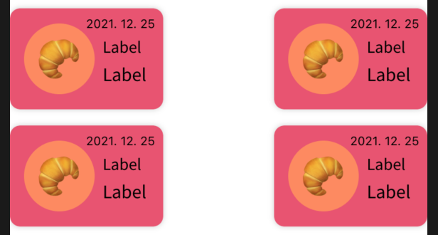

# DAILY LOG

🟡 [Day1 - 211115](#day1---211115)

🟡 [Day2 - 211116](#day2---211116)

🟡 [Day3 - 211117](#day3---211117)

🟡 [Day4 - 211118](#day4---211118)

🟡 [Day5 - 211119](#day5---211119)

🟡 [Day7 - 211121](#day7---211121)

🟡 [Day8 - 211122](#day8---211122)

🟡 [Day9 - 211123](#day9---211123)

🟡 [Day10 - 211124](#day10---211124)

🟡 [Day11 - 211125](#day11---211125)

🟡 [Day12 - 211126](#day12---211126)

🟡 [Day13 - 211127](#day13---211127)

🟡 [Day14 - 211128](#day14---211128)

<br>

<hr>

## Day1 - 211115

* ### 와이어프레임


> [색조합](https://colorhunt.co/palette/118df00e2f56ff304fececda)

<br>

* ### 기획

  * 사용자 위치
  * API: 카카오, 네이버지도
  * Realm

| 화면                   | 상세                                                         |
| ---------------------- | ------------------------------------------------------------ |
| **메인**               | - 달별로 확인 가능<br>- 수입 클릭 시 아래 숫자 키보드로 간단하게 입력<br>- *아래 지출 부분만 tableView(collectionView)<br>- selectRowAt: 수정<br>- 삭제<br>- 플로팅버튼 선택 시 입력창 modal fullscreen<br>- *아래 버튼 클릭시 지도뷰(레퍼런스: 현대카드 웨더) or 11월 아래부분 옆으로 스와이프시 |
| **작성/수정**          | - 플로팅 버튼: 입력, cell: 수정<br>- 금액부분에 커서, 키보드 숫자로 바로 띄워주기<br>- 금액 , 처리<br>- 날짜 datePicker (month) |
| **작성/수정-온라인**   | - 온라인 버튼 클릭시, textfield 생기고 키보드 올리기         |
| **작성/수정-오프라인** | - 오프라인 버튼 클릭시, searchController<br>- `카카오API` 키워드로 장소검색하기<br>- 현재위치 기준으로 반경 3키로 내 |
| **지도**               | - 오프라인 결제한곳 띄워주기<br>- `네이버지도API` <br>- custom marker(안되면 그냥 찍기)<br>- 전체보여주기<br>- 현재위치 버튼 좌측 하단 |
| **지도선택**           | - *마커 클릭시, 아래 tableView or collectionView 가로 <br>- 수정, 삭제 가능 |

<br>

<br>

## Day2 - 211116

* [기획서](./projectplan.md) 

<br>

### ⚡️TEAM BUILDING

* 팀원들과 기획을 간단히 공유했다
* 성용님이 뷰가 적다는 피드백을 해주셔서 좀 더 늘려보려고 한다

<br>

<br>

## Day3 - 211117

* [발표자료](./presentation.md) 

* 폰트, 에셋, 컬러 Extension 설정: figma에서 제플린으로 export해왔다. 제플린 쓰니까 엄청 금방 끝났다
* 화면 전환과 관련해서 swipe gesture와 hero라이브러리로 학습 겸 간단한 예제를 만들어보았다

<br>

### ⚡️TEAM BUILDING

* 구체화된 기획과 디자인, 개발공수에 대해서 공유했다

<br>

<br>

## Day4 - 211118

* 메인 뷰에서 월을 선택하게 하는데,이 부분을 어떻게 구현해야 할지 찾다가 3시간 정도 날렸다 
  * 토스처럼 구현하자니 매달 자동으로 새로운 월이 생기도록 해야하는데 .. 음,,
  * 편한가계부에 라이브러리같아 보이는걸 썼길래 당연히 라이브러리가 저렇게 이쁘게 생긴 라이브러리는 못찾겠다 !


<br>

### ⚡️TEAM BUILDING

* 경원님이 `attributedText` 에 관한 이슈를 공유해주셨다. 그리고 벌써 뷰를 거의 다 그리셨다고 한다🙊
* 수환님은 기획한 어플과 이름까지 똑같은 앱이 있어서 기획을 수정하신다고 한다
* 다국어 설정을 언제 하는게 맞는건지 조언을 구했다. 경원님께서 미리 해주는게 좋다고 말해주셔서 오늘 하려고 한다
* 팀원 모두 배고파서 금방 끝냈다
* 팀빌딩 이렇게 적어도 되는건지 모르겠다

<br>

<br>

## Day5 - 211119

* 메인 뷰 월 달력(?) 만들었다 ! !!!!!!!!!
* 셀 안에 버튼 클릭 이벤트 구현을 한참 헤맸다. `didSelectItemAt` 가 아니라 `cellForItemAt`에서 `addTarget`으로 넣어주는거 까먹지 말자
* 아직 처음 화면에서 현재 몇 월인지 보여주는 건 못했다.. 로컬라이징 안했으면 쉬운데 로컬라이징 때문에 어렵다.. 지금이라도 로컬라이징 뺄까 ㅎㅎ
* Cell 안에서 잡은 autoLayout 때문인지 뷰컨에서 코드로 구현한 크기가 안먹는다🤧



~~요즘 계속 6시부터 졸려서 11시쯤 잠이 깨는데 나는 대체 어느 나라를 살고 있는 걸까~~

<br>

### ⚡️TEAM BUILDING

* 팀원들 대부분 뷰를 다 그리셨다고.. ~~난 아직 뷰 한개도 제대로 못그렸는데~~

* 오현님은 렘 설치 에러로 고생하셨다고 한다

* 어제 고민했던 월 선택부분을 공유했는데 수환님이 엄청난 속도로 서치를 해주셨다
  * [참고1](https://stackoverflow.com/questions/3348247/uidatepicker-select-month-and-year), [참고2](https://github.com/ali-cs/AKMonthYearPickerView) : 수환님 말대로 참고2에 구현부 참고해서 만들어봐야겠다 !
  
* 성연님은 어제 깃 에러로 리셋을 하셔서 다 날리셨다고.. 백업을 잘 해둬야겠다

* 디각코(?)하기로 했다 ! 진도가 느린 나는 상주할 예정🙃

  <br>

  <br>

## Day7 - 211121

* cell 크기 안잡히는 문제해결했다,, `estimate size` !!!!!!!! 다음부턴 놓치지 말아야지


* 수입/지출뷰에서 textfieldEffects 라이브러리 사용하려고 했는데, 여러가지 고려했을 때 사용을 안하는게 나을 것 같아서 노가다로 구현하느라 생각보다 지체됐다

<br>

<br>

## Day8 - 211122

* 입력 겨우 3곳에서 받는데 이렇게 처리해야 할게 많다니🥶

* 금액 입력 처리: 1. 숫자만 입력 2. 자리 제한 3. 0으로 시작 못하도록 4. 세자리마다 반점

* 자리제한은 textField `EditingChaged`로, 세자리마다 반점은 UITextFieldDelegate의 `shouldChangeCharactersIn` 에서 시도했는데 자리제한 이상이면 숫자가 한번에 다 지워지거나, 안지워지는 문제가 있었다.

* 그래서 모두 `shouldChangeCharactersIn` 에서 처리해주어야 했는데, 세자리마다 반점 찍어주는 기존의 코드가 어렵고 복잡하게 구현되어 있어서 이해 안하고 그저 복붙해서 쓰려고 하다가 발목 제대로 잡혔다(..)

  ~~나는 왜 내 수준에 맞지 않은 어려운 기획을 했는가 괴로워하는 시간 50%, 구글링 50%, 어려운 기획 삭제할까 고민하는 시간 30%, 구현 20%,,  도합 150%의 삶을 사는 요즘,,~~

<br>

### ⚡️TEAM BUILDING

* Navigation bar title color: titleTextAttribute
* **Dispatch group**
* Tableview 데이터에 따라 cell 다르게 부르기: **Diffable DataSource**

 

## Day9 - 211123

* TableView Headerd에 searchBar 붙일때, navigationBar에 넣는 것처럼 viewDidLoad 안에서 searchController 선언과 대입이 이루어지면 아무것도 먹질 않는다

```swift
// 안되는 코드
override func viewDidLoad() {
        super.viewDidLoad()
        
        let searchController = UISearchController(searchResultsController: nil
        tableView.tableHeaderView = searchController.searchBar        
    }
```

* 이렇게 바깥에서 먼저 선언해주어야 한다

```swift
 var searchController: UISearchController!
    
    override func viewDidLoad() {
        super.viewDidLoad()
        
        searchController = UISearchController(searchResultsController: nil)
        tableView.tableHeaderView = searchController.searchBar
    }
```

* 만들다보니 ui가 이렇게 마음에 안들 수가 없다. 다른 앱들을 사용할 땐 아무 생각 없었는데 막상 만드려니 어딘가 요상하다. 개발을 잘하는 것 만큼이나 사용자로 하여금 사용하기 편하고 계속 사용하고 싶게끔 하는것도 중요하다고 생각하는데 그런 점에 있어서 나의 앱은... 더보기...

*  ui를 조금 수정해봤다. 아래 망고플레이트 레퍼런스로 지도뷰를 버튼으로 전환하도록 했고 기존 스와이프는 setting으로 넘어가도록 했다. 지도뷰에서 안에 화면이 움직이는데 그 화면 자체가 또 스와이프로 전환되는게 이상하다고 생각했기 때문. 그래도 아직 마음에 들진 않는다.


<br>

### ⚡️TEAM BUILDING

* Regular expression

* Info.plist와 권한 요청 이슈

* tableview searchbar

* simulator city run 

* timer

* location span

  <br>
  
  <br>

## Day10 - 211124

* 오프라인 질문 다녀와서 뻗었다

* 내 상태: 수면부족으로 정신가출 + 언어능력 상실한 상태에서 멘토님을 독차지해서 들뜸 + 오랜만에 수업 듣는 것 같아서 신남. 이런 환상적인 조합의 상태로 어딘가 이상하게 흥분되어있고 헛소리 작렬했는데 멘토님이 그걸 다 받아주셨다.. (감사해요 멘토님)

* 진도가 느려도 너무 느려서 정말 조급했는데 어제 멘토님 조언 듣고나서 마음이 좀 편안해졌다. 멘토님과 대화하면 항상 기분이 좋아진다🐰

  <br>

### ⚡️TEAM BUILDING

* storyboard protocol
* Datasource 파일 분리하기
* utilities 


## Day11 - 211125

* 어제 질문했던 date localize문제 해결 ! 
* 어제 피드백해주셨던 입력과 수정뷰 분기 처리 완료 !
* 너무 무서웠던 사용자 위치 받아오기와 실시간 검색(api)을 달았다. 둘 다 과제할 때까지만 해도 내가 뭘 치고 있는건지 모르는 상태에서 했는데 세번째 정도되니 이제야 좀 알것같다
* 사용자 위치 받은 이유가 사용자 위치 기준으로 반경 15km내로 검색되도록 하려 한건데, 막상 달고 보니 없애야하나 싶다. 반경 내를 우선적으로 보여주고 나머지도 다 보여주는 줄 알았는데 아예 검색이 안된다. 다른 지역에 갔다가 돌아와서 지출을 정리할 수 도 있을텐데.. 

<br>

### ⚡️TEAM BUILDING

* Locale.current.languageCode

* Method 이름을 잘보자 ! 자동완성에 너무 의존하지 말자 !

* Json asset으로 만들기 (신기하다)

* popup창 -> notification으로 옵저버달거나 viewDidAppear

* 채널톡 (바로 대화가능 무료)

  <br>

  <br>

## Day12 - 211126

* 성용님의 예언(?)대로 세팅하는데 하루종일 걸렸다. 14mid맥북 빅서로 업데이트 시도중이다 떨려🐠
* 내일은 렘을 다 달고 .. 모레는 지도뷰를 완성하는 같은 실수를 반복하는 헛된 계획 ..

<br>

### ⚡️TEAM BUILDING

* Comparable Equatable
* AVKit, AVFoundation
* DispatchQueue: group enter(), leave()

<br>

<br>

## Day13 - 211127

* 지출한 장소를 단순히 저장만 하면 될꺼라고 생각했는데, 구현하면서 생각해보니 placeId가 같으면 따로 저장하지 않고 조회만 하도록 하고, 만약 해당 장소에 주소가 바뀔 수도 있으니 데이터 update까지 고려해야 했다
* 무엇이든 입력에 대한 처리는 다 까다로운 것 같다 😇

<br>

<br>

## Day14 - 211128

* 렘도 그렇고 뷰그리는 것도 그렇고 비효율적으로 짜고 있는 것 같은 느낌이 강하다. 더 좋은 방법이 있을텐데 나는 하나하나 다 억지로 코드 쥐어짜는 느낌이랄까🌝 

* 큰일났다. 메인뷰(budget)에서 Expense랑 Place랑 연결하는데서 꼬였다. 우려했던 일이긴한데.. 

  * 지출 저장 시 온라인이면 placeId는 null값으로 두고 오프라인이면 placeId를 저장한다. 
  * 메인뷰에서 지출 cell을 불러올때 Expense에 저장된 placeId로 place데이터를 따로 받아오는데 
  * 이 과정에서 null값과 옵셔널 처리 때문에 런타임에러가 난다

  해결방법: 앞에서 indexPath.item번째 값을 가져와놓고 뒤에서 또 indexPath.item처리를 해줘서 생긴 문제였다 ㅎ 추가적으로 어디선가 데이터에 null값이 보이면 안좋다는 얘기를 들은적이 있어서 Place에 온라인 데이터를 하나 만들어 null값을 처리해주었다.

* cellForItemAt에서 생기는 index out of range 에러가 제일 무섭고 어렵다 

* 여태 옵셔널 처리는 xcode에서 자동으로 써주는데 왜 어렵다그러지? 라는 아주 안일한 생각을 가지고 있었는데 오늘 제대로 깨달았다 ^^!

* 예산 계산하는 부분에서 map이랑 reduce 사용했더니 엄청 간단하게 할 수 있었다 신기하고 재밌다

* Protocol 써봤다 !

<br>

#### 📌 디바이스로 확인할 것

* Income, Expense 입력시간, regDate 시간 확인
* dDay 날짜 12시에 확인
* 장소검색 선택시 dismiss
* 이메일 피드백 확인

<br>

<br>

## Day14 - 211129

* 엄청난 삽질을 했지만 ..^^.. 쓸 기운이 없으므로,,
* 같은 데이터를 한번에 여러곳에 보내줄땐 notification 잊지말자 ^^!
* 또 큰일 났다. 지도뷰는 정말 내 역량으로는 불가능한 곳인것같다. 장소데이터와 지출데이터 구조가 잘못된 건 아니겠지만 내 머리로는 감당 안되는 구조다ㅠ 트렌드미디어 장르 데이터 받아올때 고생했던 게 떠오르는데, 이번엔 한번 더 꼬인거같다
  * Place: placeId, categoryCode, latitude, longitude
  * Expense: PlaceId
  * Expense 데이터에 있는 place id와 Place 데이터에 place id가 같으면 해당 Place 데이터를 가져와서 Expense 데이터와 연결지어주면 되는데 나는 이게 왜이렇게 어려운지 .. 
  * cell에서 indexPath.item하고 섞이면 아주 머리 터지는 조합이다. 
  * 사용해야하는 고차함수들에 대한 이해도 조금 부족한것 같다
* 🤯

<br>

### ⚡️TEAM BUILDING

* 했는데,, 기억이 없다..

<br>

<br>

## Day15 - 211130

* 이틀째 Place 렘데이터 가져오는 부분을 해결하지 못해서 잠시 MOCO와 멀어지는 시간을 가졌다
* 온보딩에 넣을 문구랑 일러스트 고르고 개인정보처리방침 만들었다

<br>

### ⚡️TEAM BUILDING

* 테스트플라이트로 우리팀 앱들 깔아서 서로 테스트봤는데 진짜 재밌었다

<br>

<br>

## Day16 - 211201

* 온보딩 문제

  * SceneDelegate에서 처음이면 온보딩뷰를 루트뷰를 설정해주고, 온보딩뷰 마지막 페이지에서 메인페이지를 present로 띄워주었는데 여기서 문제가 생겼던 것

  * present가 아니라 온보딩 뷰를 dismiss하면서 루트뷰를 다시 메인페이지로 돌려주어야 했다

    

* searchController 두번 탭해야 dismiss되는 문제

  * tableView 위에 searchController가 올라가있어서 생기는 문제라고 

  * 먼저 searchController를 꺼줘야(?)하나보다. 한줄로 해결!

    

* 온보딩 문제

  * 이 문제는 내 좋지 않은 머리가 문제인거라.. 달리 해결방법이 없어서 조금 슬프다. ~~잭님이 해결방법이라면 해결방법~~

  ```swift
  //RealmManager.swift
  func loadPlaceCode(id: Int) -> String {
          return localRealm.objects(Place.self).filter("placeId == \(id)").first?.categoryCode ?? ""
      }
  ```

  ```swift
  //BudgetVC: cellForItemAt
  let item = expenseData[indexPath.item]
  cell.configureCell(item: item)
  ```

  ```swift
  //ExpenseCell
  func configureCell(item: Expense) {
          let placeCode = RealmManager.shared.loadPlaceCode(id: item.placeId ?? 0)
          categoryIconLabel.text = CategoryDict[placeCode]
          placeLabel.text = item.memo
          amountLabel.text = "- \(item.amount.formatWithSeparator)"
          dateLabel.text = DateFormatter.defaultFormat.string(from: item.regDate)
      }
  ```

<br>

> 1. 오늘 hue님께 들은 말들이 참 인상깊어서 나를 좀 되돌아보고 반성했다. 내가 코딩당하지말고 코딩을 해라(?) ~~분명 더 멋진 말이었는데~~ 
>
> 2. 문제가 생겼을 때 구글링해서 복붙하는 사람은 코더이고 그 문제가 어디서 어떻게 발생한건지 찾아내고 분석하고 복붙하더라도 그 코드를 이해하고 사용하는 사람이 개발자라고 한다. 
>
> 3. 그런 점에 있어서 나는 완벽한 코더였다. 코드를 짜다 문제가 생기면 어디가 다쳤을 때처럼 왜 다쳤는지, 어떻게 다친건지, 그래서 무슨 연고를 발라야하는지 생각해야되는데 나는 냅다 구글링복붙코드란 반창고를 붙여버린거다. ~~흙도 안털어내고~~
>
> 4. 같은 문제가 생겼을 때 또 똑같이 헤매는 경우가 많았고 이해를 못하고 있으니까 질문도 제대로 못했다..
>
> 5. 그리고 또 요즘 약간이라도 새로운걸 생각했다가도 뭐 조금 할줄 아는게 생겼다고 배운거나 다 마스터하자는 생각 반, 급한 맘에 빨리 아는걸로 떼우고 딴거하자는 생각 반으로 은은하게 하던것만 하게되는 것 같은 느낌이 없지 않아있었는데 어떻게 아셨는지 그것도 딱 말씀해주셨다
>
> 6. 취업하게 되면 더 촉박한 일정일텐데 지금 안하면 언제하냐고 말씀해주시는데 생각해보니 정말 그렇더라. 
>
> 7. 뭐가 그렇게 급했는지 모르겠다. 남은 교육기간이라도 대충 떼우고 다음에 공부하자라는 마음은 접어두고 그때그때 닥친 문제에 대해서 좀 더 여유를 가지고 차근차근 이해하고 공부하고 깊이 생각해보는 시간을 가져야겠다
>
> 8. 말이 많았지만 마음이 조급해질 때마다, 개발자가 아닌 코더가 되려고 할때마다 읽으면 좋을 것 같아서 남겨둔다.

<br>

<br>
