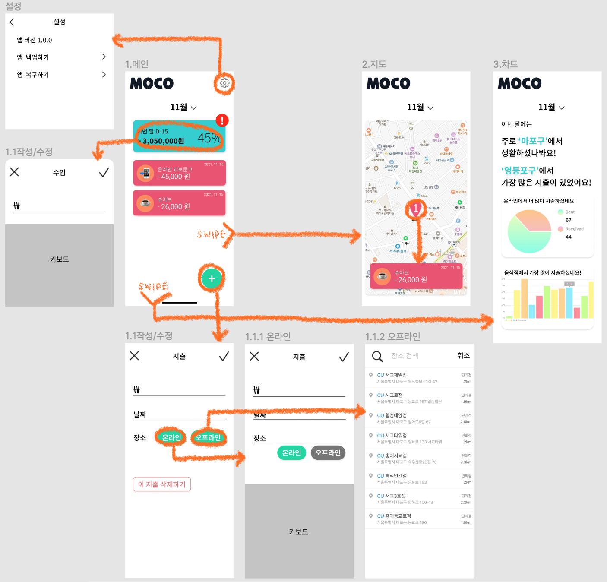

# 📑 기획서

▶︎ [앱 소개/특징](#앱-소개특징)

▶︎ [UI/UX](#uiux)

▶︎ [기능](#기능)

▶︎ [개발공수](#개발공수)

 

##  앱 소개/특징

* 간단하게 수입・지출 내역을 관리할 수 있습니다
* 지출한 장소만 입력하면 알아서 지출 내역을 분리해줍니다
* 소비지도로 이번 달 내 생활 반경을 확인할 수 있습니다
* 소비지역을 중심으로 지출 통계를 확인할 수 있습니다

 

##  UI/UX

> [색조합](https://coolors.co/25ced1-ffffff-fceade-ff8a5b-ea526f), [참고](https://coolors.co/f8ffe5-06d6a0-1b9aaa-ef476f-ffc43d)

 

##  기능

* 사용자 위치
* 영어 대응
* API: [카카오로컬](https://developers.kakao.com/docs/latest/ko/local/dev-guide#search-by-keyword), [네이버지도](https://navermaps.github.io/ios-map-sdk/guide-ko/0.html)
* 라이브러리: SwiftyJson, Realm, [Hero](https://github.com/HeroTransitions/Hero), IQKeyboard, [Charts](https://github.com/danielgindi/Charts)

| 화면                       | 기능                                                         | 상세                                                         |
| -------------------------- | ------------------------------------------------------------ | ------------------------------------------------------------ |
| **메인**                   | ✔︎ 월 별로 수입과 지출을 확인할 수 있습니다 ✔︎ 수입을 선택하면 수입을 등록거나 수정할 수 있습니다 ✔︎ 플로팅 버튼을 누르면 새 지출을 등록하고, 지출을 선택하면 해당 지출을 수정할 수 있습니다 ✔︎ 매달 1일 마다 화면이 갱신됩니다 ✔︎ 이번 달은 몇 일 남았는지, 전체 수입의 몇 퍼센트가 남았는지 확인할 수 있습니다 ✔︎ 지출이 수입을 초과하면 경고창을 뜹니다 ✔︎ 옆으로 스와이프하면 소비지도 화면을, 아래로 스와이프하면 통계화면을 볼 수 있습니다  | - 달별로 확인 가능(최신순) 🟢 예산 클릭 시 아래 숫자 키보드로 간단하게 입력 - 예산 초과 시 분기처리, alert 🟢 지출 부분만 collectionView 🟢 selectRowAt: 수정 🟢 플로팅버튼 선택 시 입력창 modal fullscreen - 매달 1일, 수입이 등록되지 않았을때 분기처리, alert 🟢 아래 버튼 클릭시 지도뷰(레퍼런스: 현대카드 웨더) or 11월 아래부분 옆으로 스와이프시 🟢 month 달력 |
| **작성/수정**              | ✔︎ 수입과 지출을 작성합니다 ✔︎ 수입은 금액만 적을 수 있습니다 ✔︎ 지출은 금액을 적고, 날짜는 캘린더에서 선택합니다 ✔︎ 장소 선택시 자동으로 카테고리가 분류됩니다 ✔︎ 수정 시 해당 지출을 삭제할 수 있습니다 | - 금액부분에 커서, 키보드 숫자로 바로 띄워주기 - 예산 초과 시 Alert 🟢 금액 , 처리 🟢 앞 글자 0 안되도록 - 삭제 시 Alert 🟢 IQKeyboard 🟢 글자 수 제한 🟢 날짜 datePicker (month) |
| **작성/수정 -온라인**   | ✔︎ 온라인 결제건은 간단한 메모를 남길 수 있습니다             | 🟢 온라인 버튼 클릭시, textfield 생기고  - 키보드 올리기 🟢 글자 수 제한 |
| **작성/수정 -오프라인** | ✔︎  결제한 장소를 검색해 등록합니다                        | 🟢 오프라인 버튼 클릭시, searchController 🟢 `카카오로컬API` 키워드로 장소검색하기 🟢 사용자 위치 꺼져있을 경우, 허용  ⁉️ 현재위치 기준으로 반경 15키로 내 |
| **지도**                   | ✔︎ 오프라인에서 지출한 곳을 월 별로 확인할 수 있습니다 ✔︎~~같은 곳에서 여러 번 지출하면 마커에 지출 횟수~~ ✔︎ 마커를 선택하면 자세한 지출 내역이 보입니다 | - 오프라인 결제한곳 띄워주기 - `네이버지도API`  - custom marker - 전체보여주기 - 현재위치 버튼 좌측 하단 \- 마커 클릭시, 아래  collectionView 가로 |
| **설정**                   | ✔︎ 백업 , 복구와 오픈 사이센스를 확인할 수 있습니다           | - 앱 백업, 복구 - 오픈 라이센스                           |
| **온보딩**                 | ✔︎ MOCO의 사용방법을 배울 수 있습니다                         | - 처음 사용시에만 띄워주기 - 사용자 위치 허용             |
| **\*통계**(update)         | ✔︎ 월 별로 다양한 지출 통계를 확인할 수 있습니다 ✔︎ 가장 자주, 많이 지출한 곳 ✔︎ 온라인과 오프라인 지출 비율 ✔︎ 카테고리별 지출 | - charts 사용 - 결제 횟수 가장 많은 구, 결제 금액 총합 가장 높은 구 - 온라인 오프라인 원차트 - 카테고리 기준 막대기차트 |
| **로컬알림**(update)       | ✔︎일정시간에 noti                                             |                                                              |

 

##  개발공수

**[이터레이션1] 11/15~11/17**: 기획 및 디자인

| [이터레이션2] 11/18~11/21             | 예상시간 | 실제시간                                                     |
| ------------------------------------- | -------- | ------------------------------------------------------------ |
| 폰트, 에셋, 컬러 Extension 설정       | 3h       | 1h : 제플린에서 빼와서 얼마 안걸렸다                         |
| 다국어 설정                           | 1h       | 3h : '이번달 D-00'이라는 말이 이상한것 같아서 고민하느라 오래걸렸다. 결국 D-00만 남겼다 |
| 스토리보드/뷰컨트롤러 화면 전환(hero) | 3h       | 2h                                                           |
| **메인 뷰** 그리기                    | 5h       | 7h : 팝업 달력과 셀 사이즈(estimate size) 덕분에 오래걸렸다 ㅎㅎ |
| **작성/수정 뷰** 그리기               | 2h       | 9h : 라이브러리 사용을 못하게 되면서 그리는데도 오래걸리고 입력 뷰이다보니 처리해줘야 할 게 많았다. 특히 금액 입력처리☠️에서 많이 헤맸다 |

| [이터레이션3] 11/22~11/24           | 예상시간 | 실제시간                                                  |
| ----------------------------------- | -------- | --------------------------------------------------------- |
| **작성/수정 뷰** searchController   | 2h       | 2h : tableview에 searchbar 다는 과정에서 조금 헤맸다      |
| **지도 뷰** 그리기 + 네이버지도 api | 3h       | 2h                                                        |
| **작성/수정뷰** 입력 처리           | 2h       | 4h(정확한 시간 모름 하루 썼음): 금액처리가 어려웠다       |
| **메인뷰** 날짜 처리                | 2h       | 4h: localize 분기처리를 어떻게 해야될지 몰라서 오래걸렸다 |
| DB 구조 짜기                        | 1h       | 1h                                                        |

| [이터레이션4] 11/25~11/28        | 예상시간 | 실제시간                     |
| -------------------------------- | -------- | ---------------------------- |
| searchController + 카카오로컬api | 4h       | 5h: 중간에 카테고리 만들었다 |
| **메인 뷰** Realm 연동           | 3h       |                              |
| **작성/수정 뷰** Realm 연동      | 3h       |                              |
| **지도 뷰** Realm 연동           | 3h       |                              |

| [이터레이션5] 11/29~12/1   | 예상시간 | 실제시간 |
| -------------------------- | -------- | -------- |
| **온보딩 뷰** 만들기       | 5h       |          |
| 버그 수정                  | 5h       |          |
| 출시                       |          |          |
| **통계 뷰** 그리기(charts) | 3h       |          |
| 통계 뷰 Realm 연동         | 5h       |          |

**[이터레이션6] 12/2~12/5**: 버그 수정

**[이터레이션7] 12/6~12/8**: 앱 업데이트

**[이터레이션8] 12/9~12/12**

